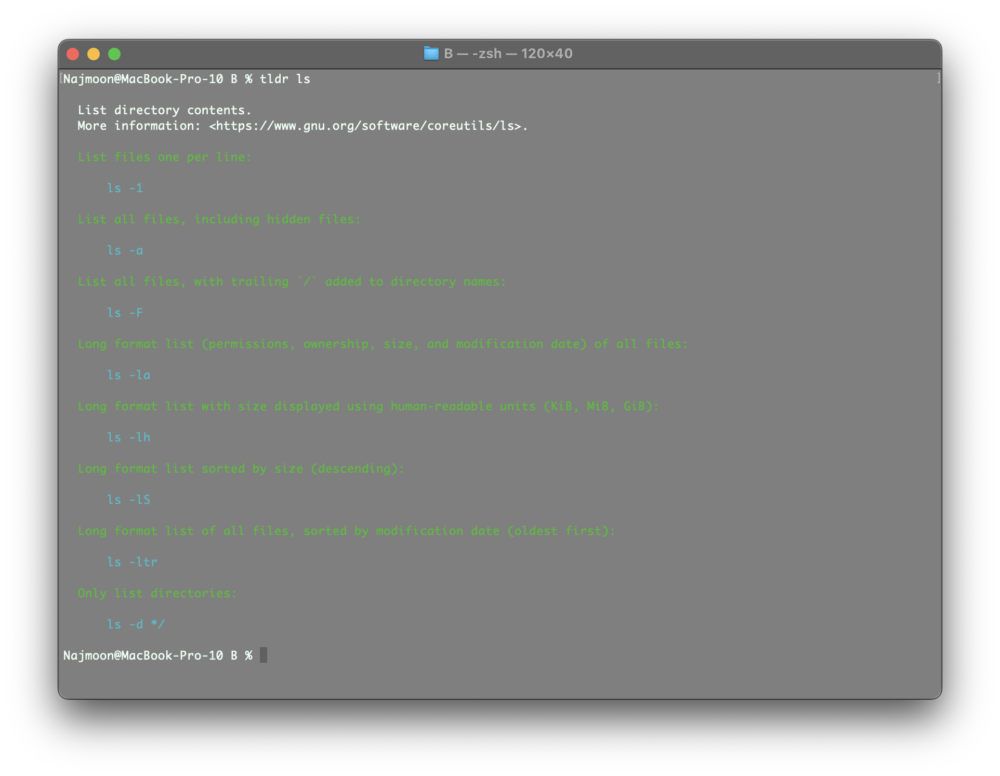
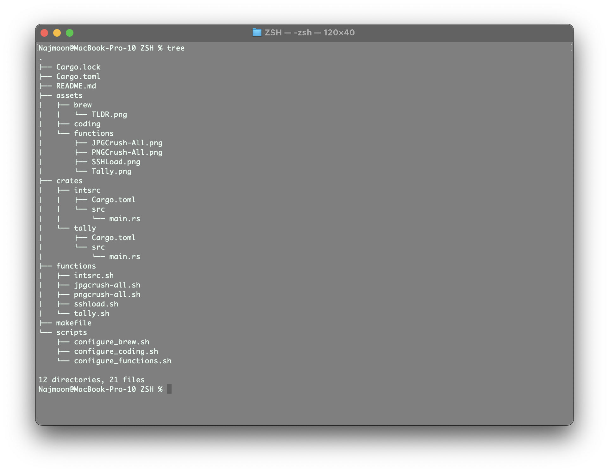
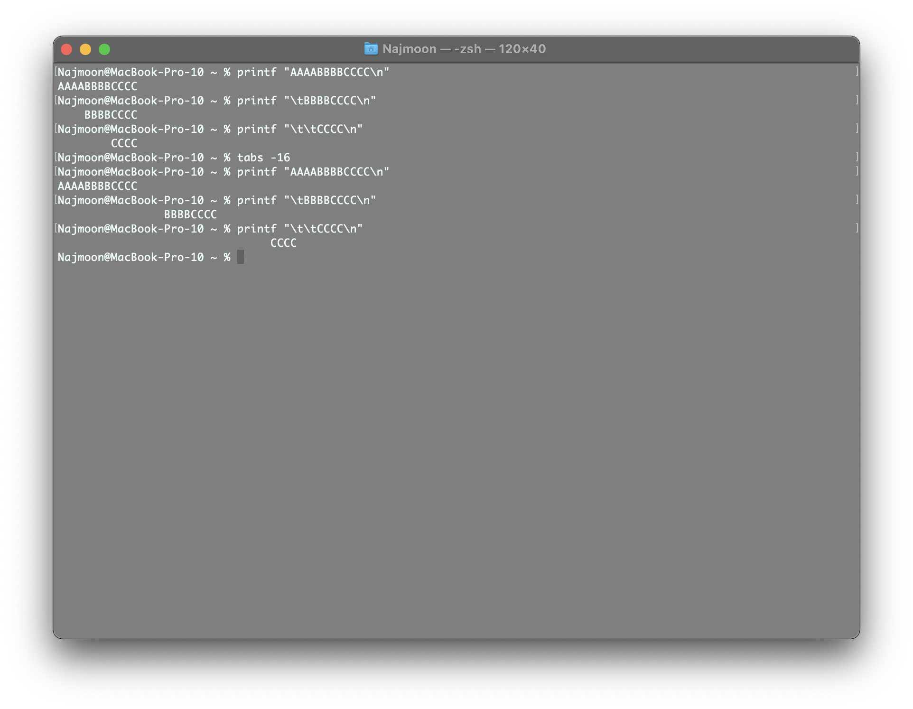
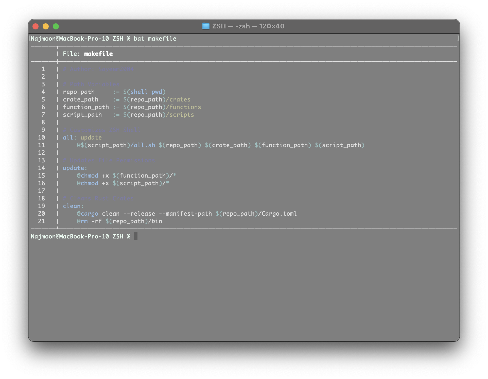
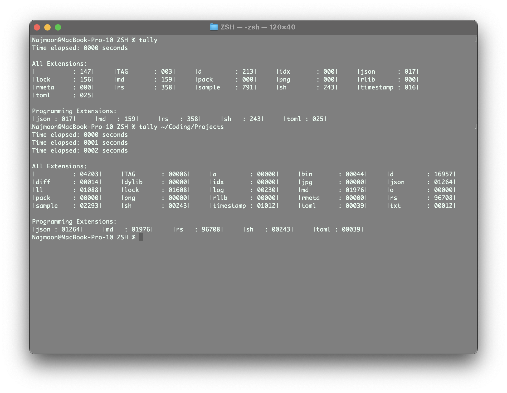
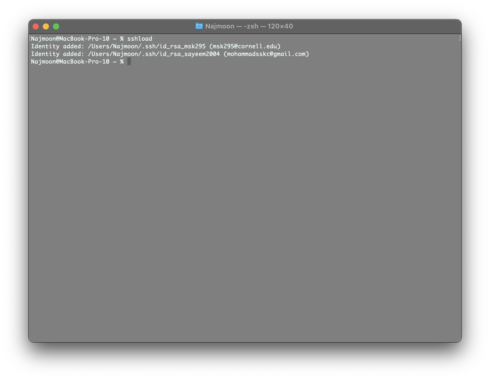
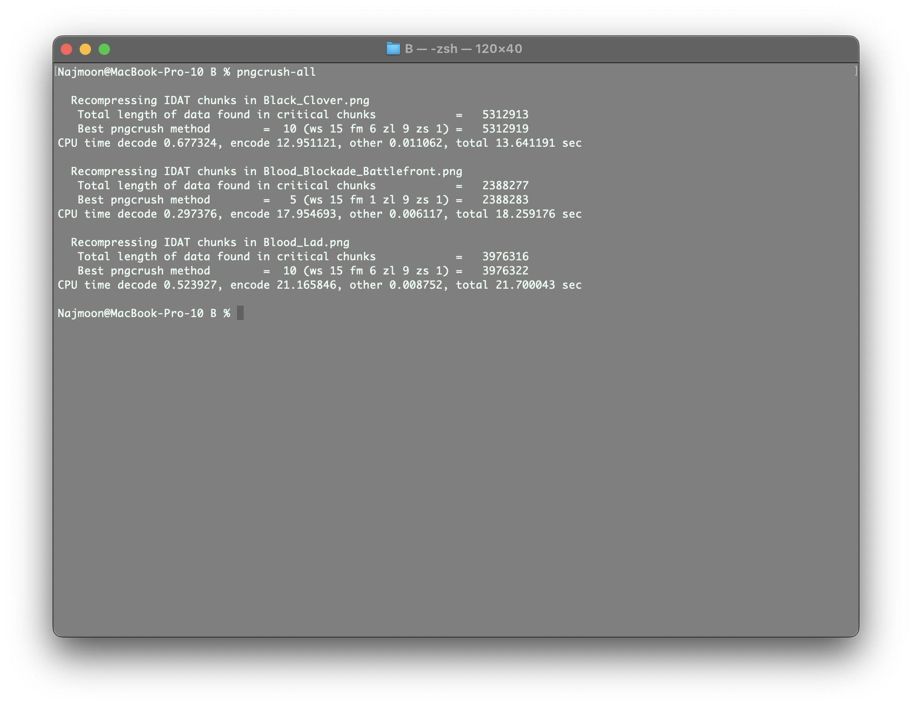
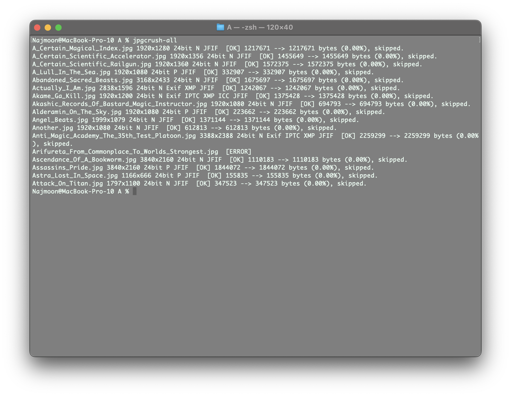
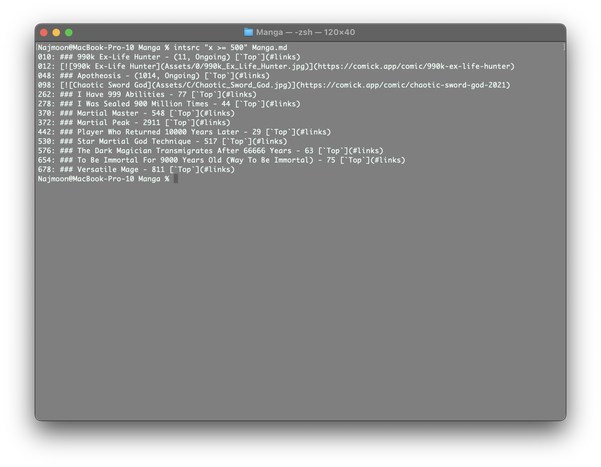

# ZSH

This is an installer for my personal ZSH configuration. It is specific to MacOS M1 and is written in Shell Script and Rust. It is a work in progress and is not intended for public use. Installation and removal instructions are provided below.

# Installation

`git clone git@github.com:Sayeem2004/ZSH.git && cd ZSH` Clones and enters the repository.

`make` Installs the project and all dependencies.

`make clean` Removes rust binaries and temporary files.

## Brew (Installation)

Installs `brew` if it is not already installed.

Uses `brew` to install the following packages.

```txt
`bat`:                      Cat clone with syntax highlighting

`gcc`:                      GNU compiler collection for C and C++
|-- `gmp`:                  (Dependency)
|-- `isl`:                  (Dependency)
|-- `libmpc`:               (Dependency)
|-- `mpfr`:                 (Dependency)
|-- |-- `texinfo`:          (Dependency)
|-- `zstd`:                 (Dependency)
|-- |-- `cmake`:            (Dependency)
|-- |-- `lz4`:              (Dependency)
|-- |-- `xz`:               (Dependency)

`jpegoptim`:                Utility to optimize JPEG files
|-- `jpeg-turbo`:           (Dependency)

`pngcrush`:                 Utility to optimize PNG files

`python`:                   Python programming language
|-- `gdbm`:                 (Dependency)
|-- `mpdecimal`:            (Dependency)
|-- `openssl@1.1`:          (Dependency)
|-- |-- `ca-certificates`:  (Dependency)
|-- `pkg-config`:           (Dependency)
|-- `readline`:             (Dependency)
|-- `sqlite`:               (Dependency)
|-- `xz`:                   (Dependency)

`tealdeer`:                 TLDR pages for terminal commands

`tree`:                     Display directories as trees
```

## Coding (Installation)

Configures the following utilities as described below. Some of these utilities are installed by `brew` while others are not.

These configurations are loaded automatically when the shell is started through the `$ZDOTDIR/.zshrc` file.

```txt
`tabs`: Configures tabs to be 4 spaces wide.
`bat`: Configures `bat` to use the `Nord` theme.
```

## Function (Installation)

Creates the `$ZDOTDIR/.zsh_functions` directory, adds it to the `fpath` variable, and then adds the following functions to the directory.

These functions are loaded automatically when the shell is started through the `$ZDOTDIR/.zshrc` file.

```txt
`tally [path]`: Counts the number of lines in the given directory and sorts them by extension type.
`sshload`: Loads in SSH identities from apple keychain.
`pngcrush-all`: Compresses and overwrites all PNG images in the current directory.
`jpgcrush-all`: Compresses and overwrites all JPG images in the current directory.
`intsrc <expression> <file>`: Prints the lines in a file that contain integers that satisfy the given expression.
```

# Removal

Automatic removal is not yet supported but the instructions for manual removal are provided below.

## Brew (Removal)

The full list of packages installed by `brew` is provided below. Use the following command to remove them.

`brew uninstall [package]` Uninstalls the specified package.

```txt
`bat`:                      Cat clone with syntax highlighting

`gcc`:                      GNU compiler collection for C and C++
|-- `gmp`:                  (Dependency)
|-- `isl`:                  (Dependency)
|-- `libmpc`:               (Dependency)
|-- `mpfr`:                 (Dependency)
|-- |-- `texinfo`:          (Dependency)
|-- `zstd`:                 (Dependency)
|-- |-- `cmake`:            (Dependency)
|-- |-- `lz4`:              (Dependency)
|-- |-- `xz`:               (Dependency)

`jpegoptim`:                Utility to optimize JPEG files
|-- `jpeg-turbo`:           (Dependency)

`pngcrush`:                 Utility to optimize PNG files

`python`:                   Python programming language
|-- `gdbm`:                 (Dependency)
|-- `mpdecimal`:            (Dependency)
|-- `openssl@1.1`:          (Dependency)
|-- |-- `ca-certificates`:  (Dependency)
|-- `pkg-config`:           (Dependency)
|-- `readline`:             (Dependency)
|-- `sqlite`:               (Dependency)
|-- `xz`:                   (Dependency)

`tealdeer`:                 TLDR pages for terminal commands

`tree`:                     Display directories as trees
```

## Utility (Removal)

To remove a specific utility configuration, follow the instructions below.

```txt
`tabs`: Remove the `tabs -4` line from the `$ZDOTDIR/.zshrc` file.
`bat`: Remove the `export BAT_THEME="Nord"` line from the `$ZDOTDIR/.zshrc` file.
```

## Function (Removal)

To remove all functions go to the `$ZDOTDIR/.zshrc` file and remove the following lines. Then delete the `$ZDOTDIR/.zsh_functions` directory.

```txt
`fpath=($ZDOTDIR/.zsh_functions $fpath)`
`autoload -U $fpath[1]/*(.:t)`
```

To remove a specific function, go to the `$ZDOTDIR/.zsh_functions` directory and remove the corresponding file. The list of functions is provided below.

```txt
`tally [path]`: Counts the number of lines in the given directory and sorts them by extension type.
`sshload`: Loads in SSH identities from apple keychain.
`pngcrush-all`: Compresses and overwrites all PNG images in the current directory.
`jpgcrush-all`: Compresses and overwrites all JPG images in the current directory.
`intsrc <expression> <file>`: Prints the lines in a file that contain integers that satisfy the given expression.
```

# Usage

After installation, the final step is to close the terminal and open a new one. In this new terminal, all the previous ZSH commands will work as well as the following commands that are specific to this configuration.

### [`Brew`](#brew-usage) [`Utility`](#utility-usage) [`Function`](#function-usage)

## Brew (Usage)

`tldr [command]`: Displays the TLDR pages for terminal commands. TLDR pages are short yet informative descriptions of terminal commands that are easier to read than MAN pages. Use `tldr -l` to list all available commands. [`Top`](#usage) 

`tree`: Displays directories as trees which is useful for visualizing the directory structure. Use `tldr tree` for more information about flag combinations. [`Top`](#usage) 

## Utility (Usage)

`tabs`: Configures tabs to be 4 spaces wide. Note that the default for ZSH is 8, which is very large. Customization can be done using `tabs -n`, where `n` is the desired tab size. [`Top`](#usage) 

`bat`: This is a clone of the `cat` command with syntax highlighting. The syntax highlighting is done using the `Nord` theme. Different themes can be found using the `--list-themes` flag and chosen using the `-theme` flag. [`Top`](#usage) 

## Function (Usage)

`tally [path]`: Counts the number of lines in the given directory and sorts them by extension type. If no path is given, the current directory is used. [`Top`](#usage) 

`sshload`: Loads in SSH identities from apple keychain. For this to cause an effect, the SSH identities must be added to the keychain beforehand. [`Top`](#usage) 

`pngcrush-all`: Compresses and overwrites all PNG images in the current directory. The resulting images are similar in quality to the original images but are smaller in size. [`Top`](#usage) 

`jpgcrush-all`: Compresses and overwrites all JPG images in the current directory. The resulting images are similar in quality to the original images but are smaller in size. [`Top`](#usage)

`intsrc <expression> <file>`: Prints the lines in a file that contain integers that satisfy the given expression. This is useful for finding lines in a file that contain integers that are within a certain range. For example, `intsrc "x >= 0 && x <= 100" --file file.txt` will print all lines in `file.txt` that contain integers between 0 and 100 inclusive. `x` must be the variable that represents the integer in the expression. [`Top`](#usage) 
