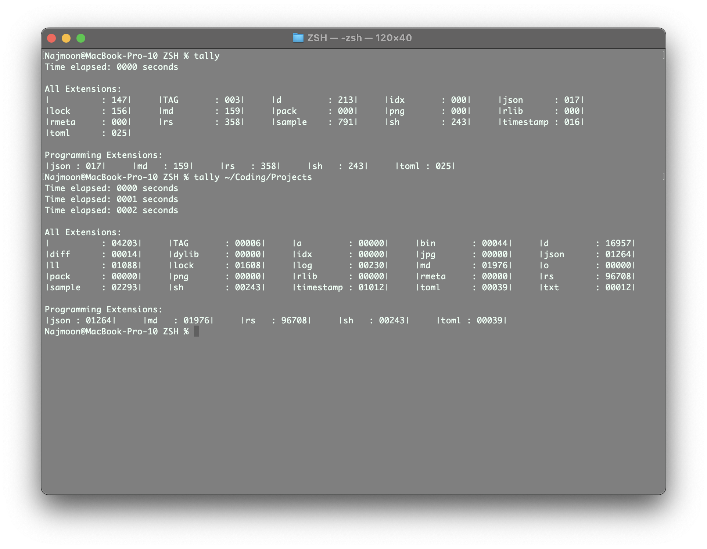
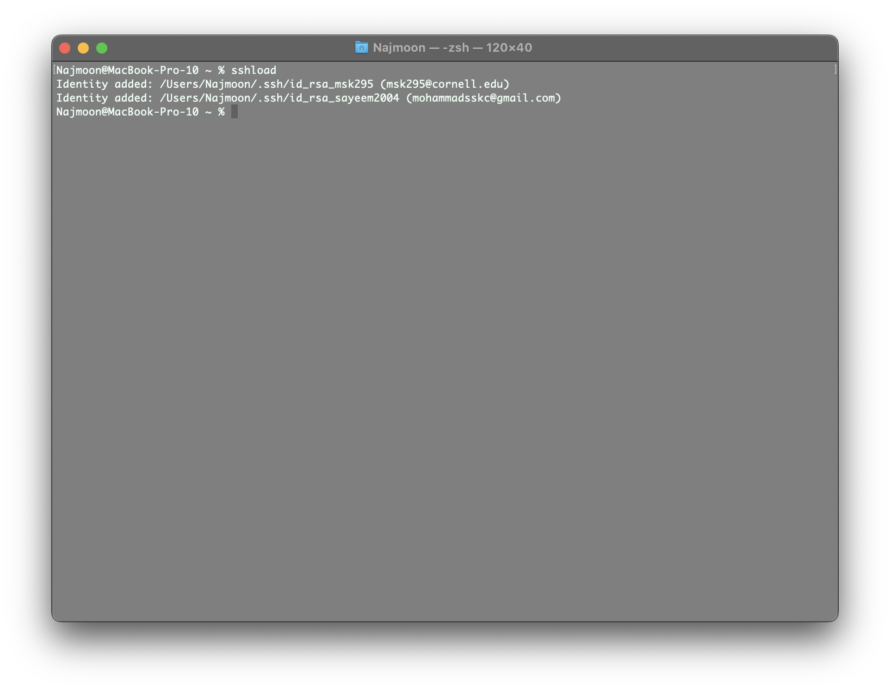
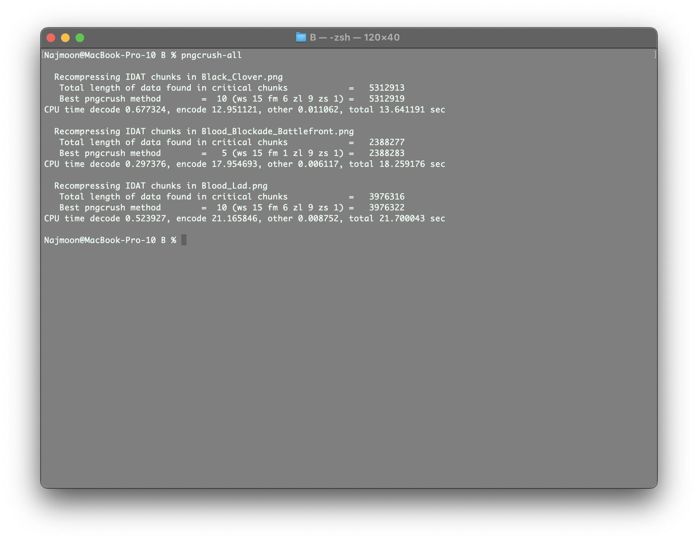
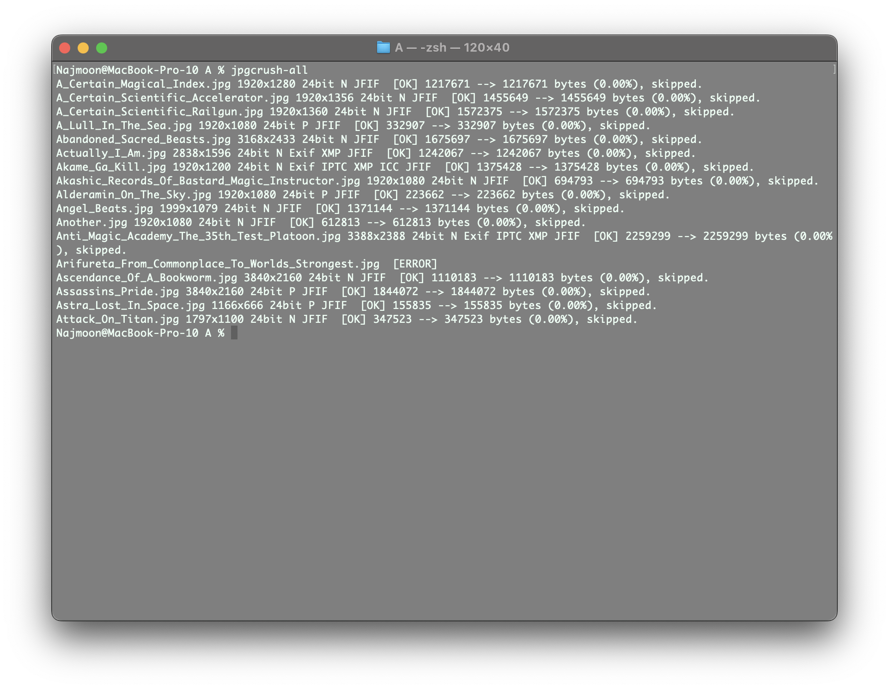
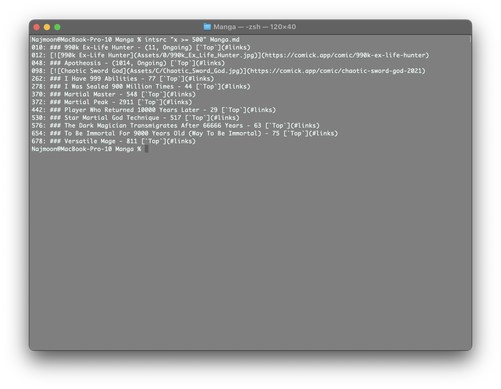

# ZSH

This is an installer for my personal ZSH configuration. It is specific to MacOS M1 and is written in Shell Script and Rust. It is a work in progress and is not intended for public use. Installation and removal instructions are provided below.

# Installation

`git clone git@github.com:Sayeem2004/ZSH.git; cd ZSH;` Clones and enters the repository.

`make install;` Installs the project and all dependencies.

## Brew

Installs `brew` if it is not already installed.

Uses `brew` to install the following packages.

```txt
gcc:                        GNU compiler collection for C and C++
|-- gmp:                    (Dependency)
|-- isl:                    (Dependency)
|-- libmpc:                 (Dependency)
|-- mpfr:                   (Dependency)
|-- |-- texinfo:            (Dependency)
|-- zstd:                   (Dependency)
|-- |-- cmake               (Dependency)
|-- |-- lz4                 (Dependency)
|-- |-- xz                  (Dependency)

jpegoptim:                  Utility to optimize JPEG files
|-- jpeg-turbo:             (Dependency)

pngcrush:                   Utility to optimize PNG files

python:                     Python programming language
|-- gdbm:                   (Dependency)
|-- mpdecimal:              (Dependency)
|-- openssl@1.1:            (Dependency)
|-- |-- ca-certificates:    (Dependency)
|-- pkg-config:             (Dependency)
|-- readline:               (Dependency)
|-- sqlite:                 (Dependency)
|-- xz:                     (Dependency)

tealdeer:                   TLDR pages for terminal commands

tree:                       Display directories as trees
```

## Coding

## Functions

Creates the `$ZDOTDIR/.zsh_functions` directory, adds it to the `fpath` variable, and then adds the following functions to the directory.

These functions are loaded automatically when the shell is started through the `$ZDOTDIR/.zshrc` file.

```txt
`tally [path]`: Counts the number of lines in the given directory and sorts them by extension type.

`sshload`: Loads in SSH identities from apple keychain.

`pngcrush-all`: Compresses and overwrites all PNG images in the current directory.

`jpgcrush-all`: Compresses and overwrites all JPG images in the current directory.

`intsrc <expression> <file>`: Prints the lines in a file that contain integers that satisfy the given expression.
```

# Removal

Automatic removal is not yet supported but the instructions for manual removal are provided below.

## Brew

The full list of packages installed by `brew` is provided below. Use the following command to remove them.

`brew uninstall [package]` Uninstalls the specified package.

```txt
gcc:                        GNU compiler collection for C and C++
|-- gmp:                    (Dependency)
|-- isl:                    (Dependency)
|-- libmpc:                 (Dependency)
|-- mpfr:                   (Dependency)
|-- |-- texinfo:            (Dependency)
|-- zstd:                   (Dependency)
|-- |-- cmake               (Dependency)
|-- |-- lz4                 (Dependency)
|-- |-- xz                  (Dependency)

jpegoptim:                  Utility to optimize JPEG files
|-- jpeg-turbo:             (Dependency)

pngcrush:                   Utility to optimize PNG files

python:                     Python programming language
|-- gdbm:                   (Dependency)
|-- mpdecimal:              (Dependency)
|-- openssl@1.1:            (Dependency)
|-- |-- ca-certificates:    (Dependency)
|-- pkg-config:             (Dependency)
|-- readline:               (Dependency)
|-- sqlite:                 (Dependency)
|-- xz:                     (Dependency)

tealdeer:                   TLDR pages for terminal commands

tree:                       Display directories as trees
```

## Coding

## Functions

To remove all functions go to the `$ZDOTDIR/.zshrc` file and remove the following lines. Then delete the `$ZDOTDIR/.zsh_functions` directory.

```txt
# MskCmd Utilities
fpath=($ZDOTDIR/.zsh_functions $fpath)
autoload -U $fpath[1]/*(.:t)
```

To remove a specific function, go to the `$ZDOTDIR/.zsh_functions` directory and remove the corresponding file. The list of functions is provided below.

```txt
`tally [path]`: Counts the number of lines in the given directory and sorts them by extension type.

`sshload`: Loads in SSH identities from apple keychain.

`pngcrush-all`: Compresses and overwrites all PNG images in the current directory.

`jpgcrush-all`: Compresses and overwrites all JPG images in the current directory.

`intsrc <expression> <file>`: Prints the lines in a file that contain integers that satisfy the given expression.
```

# Usage

After installation, the final step is to close the terminal and open a new one. In this new terminal, all the previous ZSH commands will work as well as the following commands that are specific to this configuration.

## Brew

`tldr [command]`: Displays the TLDR pages for terminal commands. TLDR pages are short yet informative descriptions of terminal commands that are easier to read than MAN pages. Use `tldr -l` to list all available commands. 

`tree`: Displays directories as trees which is useful for visualizing the directory structure. Use `tldr tree` for more information about flag combinations. 

## Coding

## Functions

`tally [path]`: Counts the number of lines in the given directory and sorts them by extension type. If no path is given, the current directory is used. 

`sshload`: Loads in SSH identities from apple keychain. For this to cause an effect, the SSH identities must be added to the keychain beforehand. 

`pngcrush-all`: Compresses and overwrites all PNG images in the current directory. The resulting images are similar in quality to the original images but are smaller in size. 

`jpgcrush-all`: Compresses and overwrites all JPG images in the current directory. The resulting images are similar in quality to the original images but are smaller in size. 

`intsrc <expression> <file>`: Prints the lines in a file that contain integers that satisfy the given expression. This is useful for finding lines in a file that contain integers that are within a certain range. For example, `intsrc "x >= 0 && x <= 100" --file file.txt` will print all lines in `file.txt` that contain integers between 0 and 100 inclusive. `x` must be the variable that represents the integer in the expression. 
