# ZSH

This is an installer for my personal ZSH configuration. It is specific to MacOS M1 and is written in Shell Script and Rust. It is a work in progress and is not intended for public use. Installation and removal instructions are provided below.

# Installation

`git clone git@github.com:Sayeem2004/ZSH.git && cd ZSH` Clones and enters the repository.

`make` Installs the project and all dependencies.

`make clean` Removes rust binaries and temporary files.

## Brew (Installation)

Installs `brew` if it is not already installed.

Uses `brew` to install the following packages.

```md
`gcc`:                      GNU compiler collection for C and C++
|-- `gmp`:                  (Dependency)
|-- `isl`:                  (Dependency)
|-- `libmpc`:               (Dependency)
|-- `mpfr`:                 (Dependency)
|-- |-- `texinfo`:          (Dependency)
|-- `zstd`:                 (Dependency)
|-- |-- `cmake`:            (Dependency)
|-- |-- `lz4`:              (Dependency)
|-- |-- `xz`:               (Dependency)

`jpegoptim`:                Utility to optimize JPEG files
|-- `jpeg-turbo`:           (Dependency)

`pngcrush`:                 Utility to optimize PNG files

`tree`:                     Display directories as trees

`python`:                   Python programming language
|-- `gdbm`:                 (Dependency)
|-- `mpdecimal`:            (Dependency)
|-- `openssl@1.1`:          (Dependency)
|-- |-- `ca-certificates`:  (Dependency)
|-- `pkg-config`:           (Dependency)
|-- `readline`:             (Dependency)
|-- `sqlite`:               (Dependency)
|-- `xz`:                   (Dependency)

`bat`:                      Cat clone with syntax highlighting

`tealdeer`:                 TLDR pages for terminal commands

`rustup-init`:              Rust toolchain installer

`node`:                     Platform to build network applications
|-- `brotli`:               (Dependency)
|-- |-- `cmake`:            (Dependency)
|-- `c-ares`:               (Dependency)
|-- `icu4c`:                (Dependency)
|-- `libnghttp2`:           (Dependency)
|-- |-- `pkg-config`:       (Dependency)
|-- `libuv`:                (Dependency)
|-- |-- `autoconf`:         (Dependency)
|-- |-- `automake`:         (Dependency)
|-- |-- `libtool`:          (Dependency)
|-- |-- `sphinx-doc`:       (Dependency)
|-- `openssl@1.1`:          (Dependency)
|-- |-- `ca-certificates`:  (Dependency)

`ruby-install`:             Ruby installer
|-- `bison`:                (Dependency)
|-- `libffi`:               (Dependency)
|-- `libyaml`:              (Dependency)
|-- `xz`:                   (Dependency)
```

## Utility (Installation)

Configures the following utilities and files as described below. Some of these utilities are installed by `brew` while others are not.

These configurations are loaded automatically when the shell is started through the `$ZDOTDIR/.zshrc` file.

```md
`zshrc1`: Prepares the `$ZDOTDIR/.zshrc` file.
`functions`: Prepares the `$ZDOTDIR/.zsh_functions` directory.
`tabs`: Configures tabs to be 4 spaces wide.
`bat`: Configures `bat` to use the `Nord` theme.
`python`: Aliases `python` to `python3`.
`rust`: Installs `rustup` and `cargo`.
`less`: Removes the `less` history file.
`sdkman`: Installs `sdkman`.
`java`: Installs `java` using `sdkman`.
`vim`: Edits locations of `vim` configuration files.
`npm`: Configures `npm` variables.
`node`: Installs `node` using `npm`.
`http-server`: Installs `http-server` using `npm`.
`ruby`: Installs `ruby` using `ruby-install`.
`jekyll`: Installs `jekyll` using `gem`.
`zshrc2`: Finishes the `$ZDOTDIR/.zshrc` file.
```

## Function (Installation)

Creates the `$ZDOTDIR/.zsh_functions` directory, adds it to the `fpath` variable, and then adds the following functions to the directory.

These functions are loaded automatically when the shell is started through the `$ZDOTDIR/.zshrc` file.

```md
`tally [path]`: Counts the number of lines in the given directory and sorts them by extension type.
`sshload`: Loads in SSH identities from apple keychain.
`pngcrush-all`: Compresses and overwrites all PNG images in the current directory.
`jpgcrush-all`: Compresses and overwrites all JPG images in the current directory.
`intsrc <expression> <file>`: Prints the lines in a file that contain integers that satisfy the given expression.
`gview [path]`: Prints the contents of a file or directory in a graphical view.
`viewpath`: Prints the PATH environment variable in a readable format.
```

# Removal

Automatic removal is not yet supported but the instructions for manual removal are provided below.

## Brew (Removal)

The full list of packages installed by `brew` is provided below. Use the following command to remove them.

`brew uninstall [package]` Uninstalls the specified package.

```md
`gcc`:                      GNU compiler collection for C and C++
|-- `gmp`:                  (Dependency)
|-- `isl`:                  (Dependency)
|-- `libmpc`:               (Dependency)
|-- `mpfr`:                 (Dependency)
|-- |-- `texinfo`:          (Dependency)
|-- `zstd`:                 (Dependency)
|-- |-- `cmake`:            (Dependency)
|-- |-- `lz4`:              (Dependency)
|-- |-- `xz`:               (Dependency)

`jpegoptim`:                Utility to optimize JPEG files
|-- `jpeg-turbo`:           (Dependency)

`pngcrush`:                 Utility to optimize PNG files

`tree`:                     Display directories as trees

`python`:                   Python programming language
|-- `gdbm`:                 (Dependency)
|-- `mpdecimal`:            (Dependency)
|-- `openssl@1.1`:          (Dependency)
|-- |-- `ca-certificates`:  (Dependency)
|-- `pkg-config`:           (Dependency)
|-- `readline`:             (Dependency)
|-- `sqlite`:               (Dependency)
|-- `xz`:                   (Dependency)

`bat`:                      Cat clone with syntax highlighting

`tealdeer`:                 TLDR pages for terminal commands

`rustup-init`:              Rust toolchain installer

`node`:                     Platform to build network applications
|-- `brotli`:               (Dependency)
|-- |-- `cmake`:            (Dependency)
|-- `c-ares`:               (Dependency)
|-- `icu4c`:                (Dependency)
|-- `libnghttp2`:           (Dependency)
|-- |-- `pkg-config`:       (Dependency)
|-- `libuv`:                (Dependency)
|-- |-- `autoconf`:         (Dependency)
|-- |-- `automake`:         (Dependency)
|-- |-- `libtool`:          (Dependency)
|-- |-- `sphinx-doc`:       (Dependency)
|-- `openssl@1.1`:          (Dependency)
|-- |-- `ca-certificates`:  (Dependency)

`ruby-install`:             Ruby installer
|-- `bison`:                (Dependency)
|-- `libffi`:               (Dependency)
|-- `libyaml`:              (Dependency)
|-- `xz`:                   (Dependency)
```

## Utility (Removal)

To remove a specific utility configuration, follow the instructions below.

```md
`zhsrc1`: Remove the lines directly adjacent to `# Start Of Sayeem2004's ZSH Customization`
`functions`: Remove the lines directly adjacent to `# Configuring functions`
`tabs`: Remove the lines directly adjacent to `# Configuring tabs`
`bat`: Remove the lines directly adjacent to `# Configuring bat`
`python`: Remove the lines directly adjacent to `# Configuring python`
`rust`: Remove the lines directly adjacent to `# Configuring rust` and delete the `~/.cache/cargo` and `~/.cache/rustup` directory.
`less`: Remove the lines directly adjacent to `# Configuring less`
`sdkman`: Remove the lines directly adjacent to `# Configuring sdkman` and delete the `~/.cache/sdkman` directory.
`java`: Run `sdk uninstall java` to remove the `java` package.
`vim`: Remove the lines directly adjacent to `# Configuring vim`
`npm`: No guide yet.
`node`: Remove the lines directly adjacent to `# Configuring node`
`http-server`: Run `npm uninstall http-server` to remove the `http-server` package.
`ruby`: Remove the lines directly adjacent to `# Configuring ruby` and delete the `~/cache/rubies` directory.
`jekyll`: Run `gem uninstall jekyll` to remove the `jekyll` package.
`zshrc2`: Remove the lines directly adjacent to `# End Of Sayeem2004's ZSH Customization`
```

## Function (Removal)

To remove all functions go to the `$ZDOTDIR/.zshrc` file and remove the following lines. Then delete the `$ZDOTDIR/.zsh_functions` directory.

```txt
# Configuring functions
fpath=($ZDOTDIR/.zsh_functions $fpath)
autoload -U $fpath[1]/*(.:t)
```

To remove a specific function, go to the `$ZDOTDIR/.zsh_functions` directory and remove the corresponding file. The list of functions is provided below.

```md
`tally [path]`: Counts the number of lines in the given directory and sorts them by extension type.
`sshload`: Loads in SSH identities from apple keychain.
`pngcrush-all`: Compresses and overwrites all PNG images in the current directory.
`jpgcrush-all`: Compresses and overwrites all JPG images in the current directory.
`intsrc <expression> <file>`: Prints the lines in a file that contain integers that satisfy the given expression.
`gview [path]`: Prints the contents of a file or directory in a graphical view.
`viewpath`: Prints the PATH environment variable in a readable format.
```

# Usage

After installation, the final step is to close the terminal and open a new one. In this new terminal, all the previous ZSH commands will work as well as the following commands that are specific to this configuration.

### [`Brew`](#brew-usage) [`Utility`](#utility-usage) [`Function`](#function-usage)

## Brew (Usage)

`brew`: A package manager for MacOS. Used to install basically everything else in this project. Use `brew help` for more information. [`Top`](#usage) 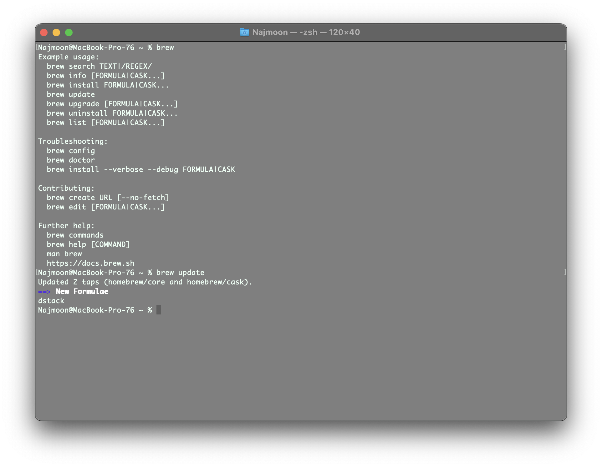

`gcc`: GNU Compiler Collection for C and C++. Use `gcc <file>` or `g++ <file>` to compile C and C++ respectively. [`Top`](#usage) 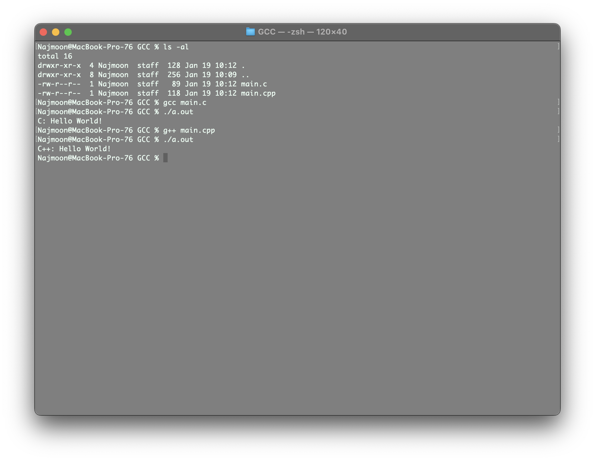

`tldr [command]`: Displays the TLDR pages for terminal commands. TLDR pages are short yet informative descriptions of terminal commands that are easier to read than MAN pages. Use `tldr -l` to list all available commands. [`Top`](#usage) 

`tree`: Displays directories as trees which is useful for visualizing the directory structure. Use `tldr tree` for more information about flag combinations. [`Top`](#usage) 

## Utility (Usage)

`tabs`: Configures tabs to be 4 spaces wide. Note that the default for ZSH is 8, which is very large. Customization can be done using `tabs -n`, where `n` is the desired tab size. [`Top`](#usage) 

`bat`: This is a clone of the `cat` command with syntax highlighting. The syntax highlighting is done using the `Nord` theme. Different themes can be found using the `--list-themes` flag and chosen using the `-theme` flag. [`Top`](#usage) 

`python`: Provides a Python 3.11.1 environment for programming. Run a python file with `python [file]` [`Top`](#usage) 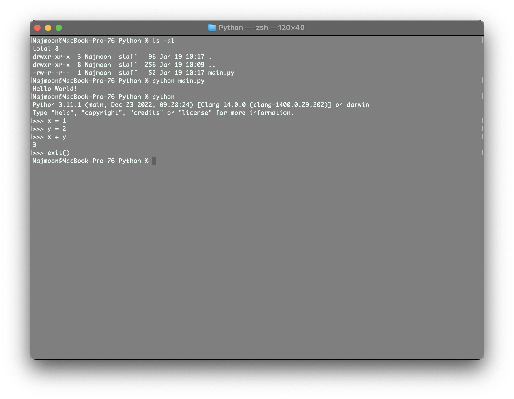

`rust`: Provides a Rust 1.57.0 environment for programming. Run a rust file with `rustc [file]`. Create a rust project with `cargo init`. [`Top`](#usage) 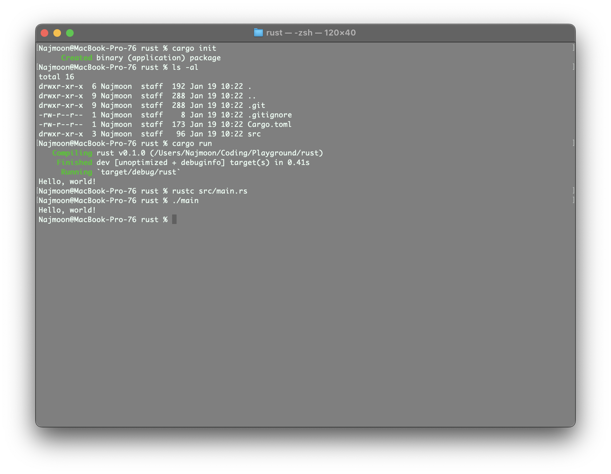

`sdk`: Package manager for Java and related technologies. Use `sdk help` for more information. [`Top`](#usage) 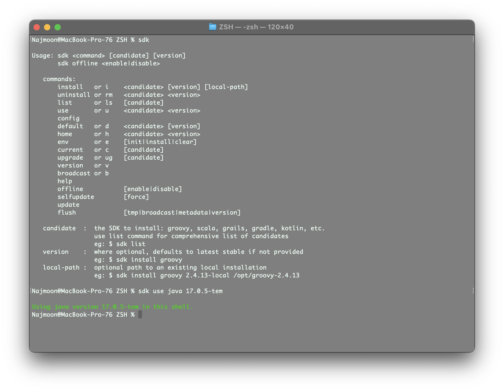

`java`: Provides a Java 17.0.5 environment for programming. Run a java file with `javac [file]` and `java [file]`. [`Top`](#usage) 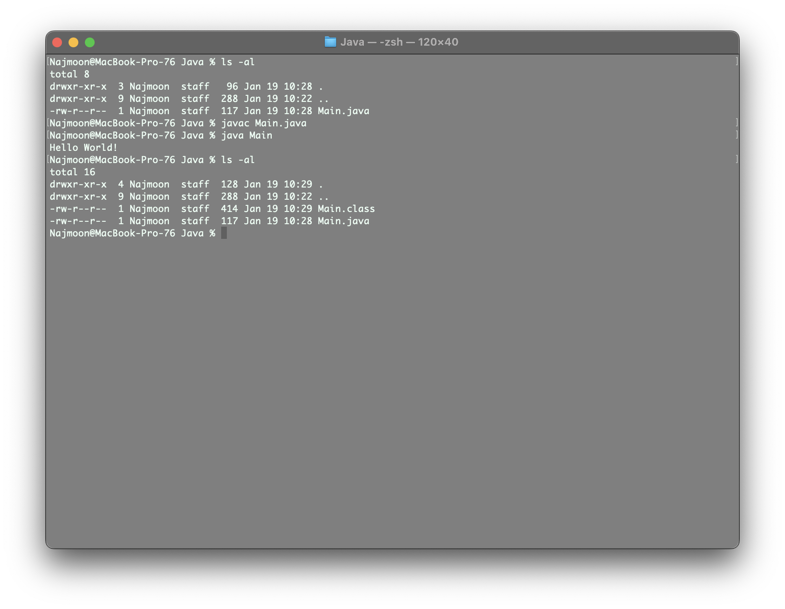

`node`: Provides a Node 19.4.0 environment for programming. Run a file with `node [file]` or use `node` to start a prompt. [`Top`](#usage) 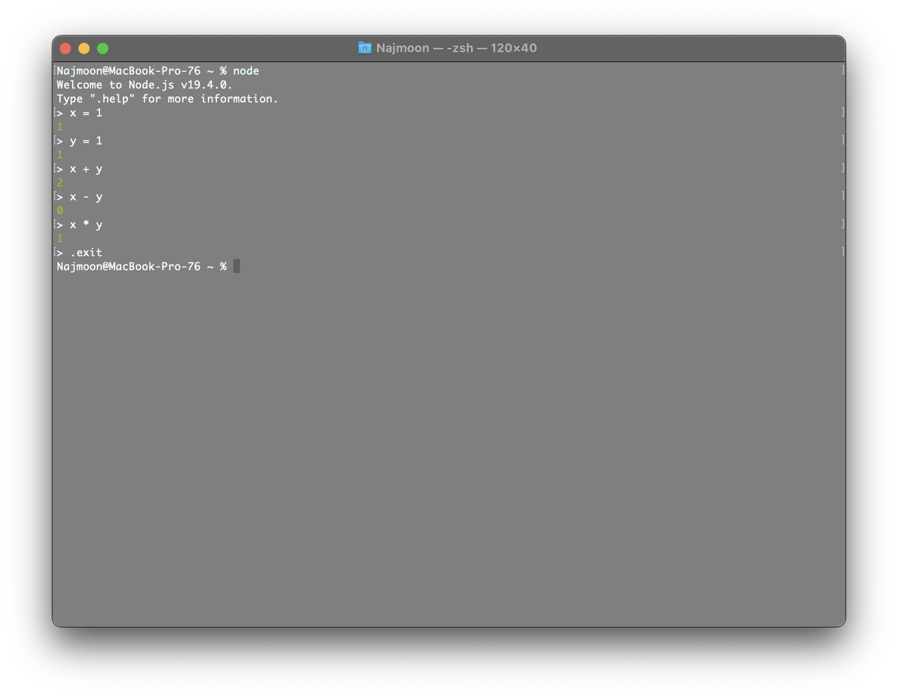

`http-server`: Provides a web server for hosting static websites. Use `http-server -c-1 [path]` to start the server. [`Top`](#usage) 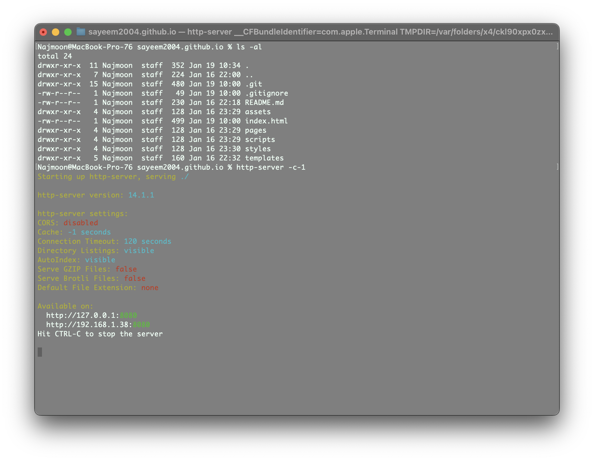

`ruby`: Provides a Ruby 3.2.0 environment for programming. Run a ruby file with `ruby [file]` or use `irb` to start a prompt. [`Top`](#usage) 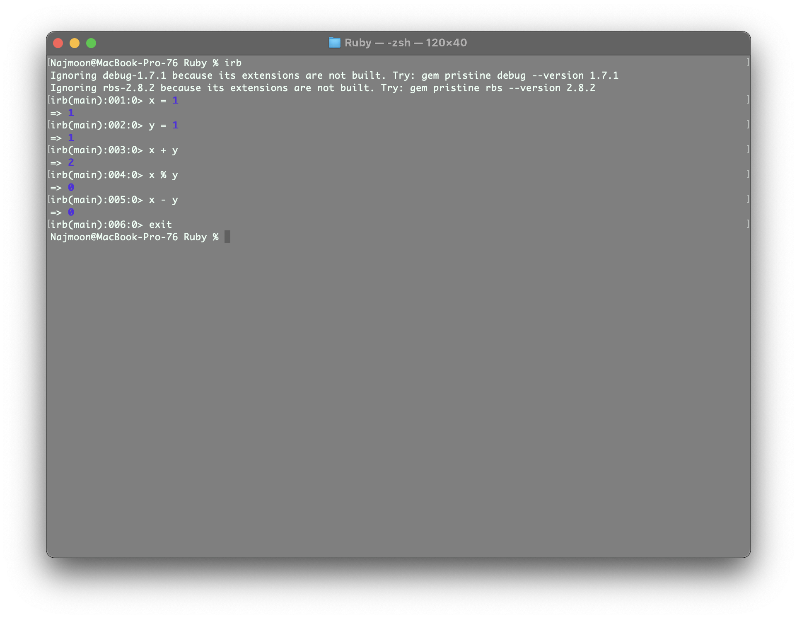

`jekyll`: Provides a Jekyll 4.3.1 environment for creating and hosting websites. Use `jekyll build` and `jekyll serve` to host the website. [`Top`](#usage) 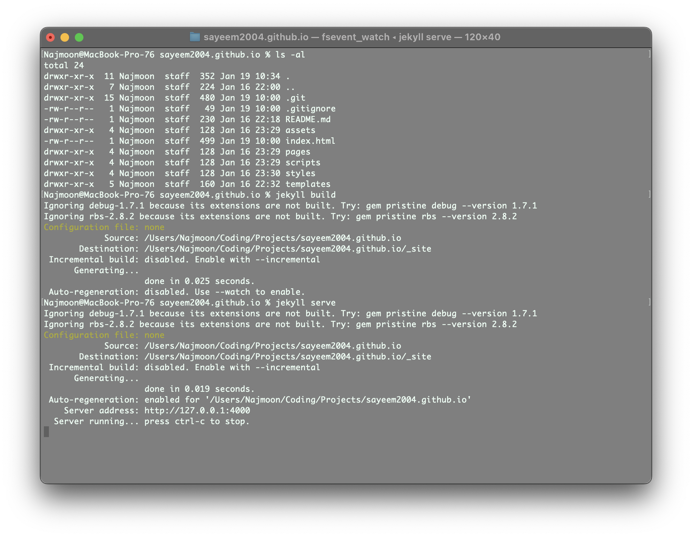

## Function (Usage)

`tally [path]`: Counts the number of lines in the given directory and sorts them by extension type. If no path is given, the current directory is used. [`Top`](#usage) 

`sshload`: Loads in SSH identities from apple keychain. For this to cause an effect, the SSH identities must be added to the keychain beforehand. [`Top`](#usage) 

`pngcrush-all`: Compresses and overwrites all PNG images in the current directory. The resulting images are similar in quality to the original images but are smaller in size. [`Top`](#usage) 

`jpgcrush-all`: Compresses and overwrites all JPG images in the current directory. The resulting images are similar in quality to the original images but are smaller in size. [`Top`](#usage)

`intsrc <expression> <file>`: Prints the lines in a file that contain integers that satisfy the given expression. This is useful for finding lines in a file that contain integers that are within a certain range. For example, `intsrc "x >= 0 && x <= 100" --file file.txt` will print all lines in `file.txt` that contain integers between 0 and 100 inclusive. `x` must be the variable that represents the integer in the expression. [`Top`](#usage) 

`gview [path]`: Prints the contents of a file or directory in a graphical view. If no path is given, the current directory is used. If a file is used, it should follow the given format described by `gview help`. [`Top`](#usage) 

`viewpath`: Prints the PATH environment variable in a readable format. [`Top`](#usage) 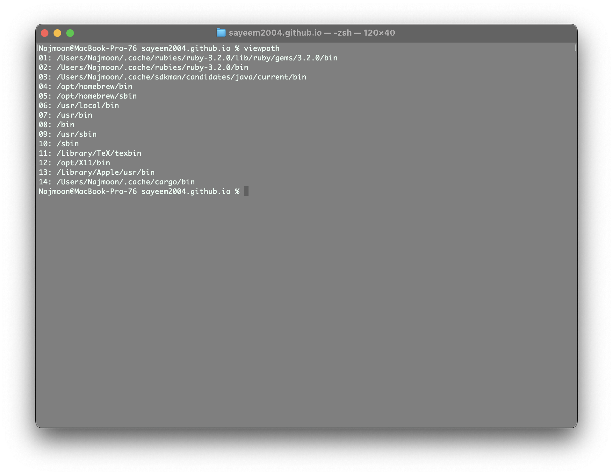
